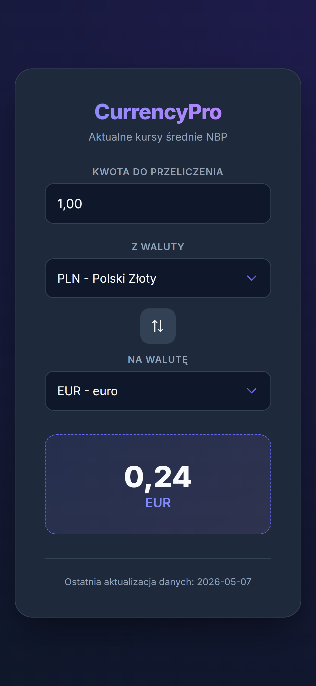

# CurrencyPro – Przelicznik Walut z NBP API

Intuicyjny przelicznik walut oparty na aktualnych kursach Narodowego Banku Polskiego. Aplikacja pozwala na szybkie przeliczanie kwot między wieloma walutami w czasie rzeczywistym, dbając o precyzję danych i komfort użytkowania.

## Jak to działa?

Aplikacja po załadowaniu automatycznie pobiera najnowsze tabele kursów z API NBP. Użytkownik wprowadza kwotę i wybiera interesujące go waluty z dynamicznie generowanych list. Wynik aktualizuje się przy każdej zmianie parametrów.

## Funkcje

- **Dane Real-time:** Integracja z API NBP przez funkcję fetch (Tabela A) zapewnia zawsze aktualne kursy walut.
- **Walidacja wyboru:** System zapobiega wybraniu tej samej waluty w obu polach jednocześnie.
- **Obsługa błędów:** W przypadku problemów z API, aplikacja blokuje interfejs i informuje użytkownika o braku dostępu do danych.
- **Modern Design:** Estetyczny **Dark Mode** z responsywnym układem mobile-first dopasowanym do każdego urządzenia.

## Logika Konwersji
Aplikacja wykorzystuje algorytm przeliczania oparty na walucie bazowej (PLN), co pozwala na konwersję między dowolnymi dwiema walutami obcymi przy jednym zapytaniu do API:

$$Wynik = Kwota \cdot \frac{Kurs_{wejsciowy}}{Kurs_{wyjsciowy}}$$

- $Kurs_{wejsciowy}$ – kurs waluty, z której wartość jest przeliczana (wyrażony w PLN).
- $Kurs_{wyjsciowy}$ – kurs waluty, którą chcesz otrzymać (wyrażony w PLN).

## Zobacz demo

### Podgląd działania

### Link do testu
[Demo CurrencyPro](https://rayskidev.github.io/currency-calculator/)

## Środowisko testowe

- Opera GX
- Microsoft Edge
- Firefox
- Google Chrome
